# STRIQ — STReaming Indexed Query compression

**Compress time series up to 7x. Query without decompressing. Pure C, zero dependencies.**


STRIQ compresses floating-point sensor data with user-controlled error bounds
and answers aggregate queries (mean, min, max, sum, variance) **directly on
compressed data** in sub-microsecond time.

> Your IoT gateway generates 1 GB/day of sensor readings. STRIQ turns it into
> ~150 MB and still tells you the average temperature last month in 0.4 µs.

---

## At a Glance

Jena Climate dataset, 420 551 rows, column `p (mbar)`, ε = 0.01:

| Metric | STRIQ | Gorilla | LZ4 | Zstd |
|---|---|---|---|---|
| Compressed size | **0.9 MB** | 2.4 MB | 1.3 MB | 0.8 MB |
| Compression ratio | **3.43x** | 1.32x | 2.38x | 4.02x |
| `mean()` latency | **0.4 µs** | 34,267 µs* | 979 µs* | 3,427 µs* |
| Encode throughput | 615 MB/s | 92 MB/s | 564 MB/s | 331 MB/s |

Raw column: 3.2 MB (420 551 × float64). *Require full decompression before any query.

Zstd compresses ~15% tighter but requires full decompression for any query. STRIQ trades a bit of ratio for sub-microsecond queryability on compressed data.

The 7x figure comes from high-autocorrelation signals (e.g. near-constant sensor readings with long flat stretches, ε=0.01). Typical climate/weather columns land in the 2.5x–3.5x range, as shown above. See [detailed benchmarks](#detailed-benchmarks) for the full dataset breakdown.

---

## Install

```bash
git clone https://github.com/NahumResearch/striq.git
cd striq
make
sudo make install   # optional: installs striq CLI to /usr/local/bin
```

Builds on Linux, macOS, and any POSIX system with a C11 compiler.

> **Python bindings:** [py-striq](https://github.com/NahumResearch/py-striq) (cffi wrapper). `pip install striq` coming soon.

---

## Quick Start: CLI

```bash
# Compress a CSV with ε = 0.01 (max reconstruction error)
striq compress sensor_data.csv sensor_data.striq 0.01

# Query directly on compressed file
striq query sensor_data.striq mean temp
# → mean = 24.8732  (1,000,000 rows, 100% algebraic, 2.8 μs)

striq query sensor_data.striq mean temp --from 1700000000000 --to 1700100000000
striq query sensor_data.striq min pressure
striq query sensor_data.striq variance temp

# Point lookup and range scan
striq query sensor_data.striq value_at temp,pressure 1700000000000
striq query sensor_data.striq scan temp,pressure --from 1700000000000 --to 1700100000000

# Inspect file metadata
striq inspect sensor_data.striq

# Verify integrity
striq verify sensor_data.striq
```

---

## Quick Start: C API

```c
#include "striq.h"

const char *cols[]       = { "temp", "pressure" };
striq_coltype_t types[]  = { STRIQ_COL_FLOAT64, STRIQ_COL_FLOAT64 };

striq_opts_t opts = STRIQ_DEFAULTS;
opts.epsilon = 0.01;

striq_writer_t *w = striq_writer_open("sensor.striq", cols, types, 2, &opts);
for (...)
    striq_writer_add_row(w, timestamp_ns, values, 2);
striq_writer_close(w);

striq_reader_t *r = striq_reader_open("sensor.striq");
striq_result_t res;
striq_query_mean(r, "temp", 0, 0, &res);
printf("mean=%.4f  (%llu rows, %.0f%% algebraic)\n",
       res.value, res.rows_scanned, res.pct_algebraic);
striq_reader_close(r);
```

---

## When to Use STRIQ

**Good fit:**
- IoT / industrial sensor data (temperature, pressure, vibration, RPM)
- Time series with moderate-to-high autocorrelation (most physical sensors)
- Queryable compressed archives (no decompression step)
- Edge devices with limited storage: Raspberry Pi, gateways, embedded Linux
- Cold storage that still needs to answer queries

**Not the right tool:**
- General-purpose file compression (use zstd)
- String or categorical data (STRIQ is numeric float64 only)
- Lossless-only requirements with zero tolerance for approximation error
  (STRIQ is bounded-error lossy for values, lossless for timestamps.
  At ε=0.01, every reconstructed value is within ±0.01 of the original)
- Data without a timestamp axis (STRIQ assumes time-ordered input)
- Real-time OLAP workloads (use ClickHouse, TimescaleDB, DuckDB)

---

## How It Works

### Encoding Pipeline

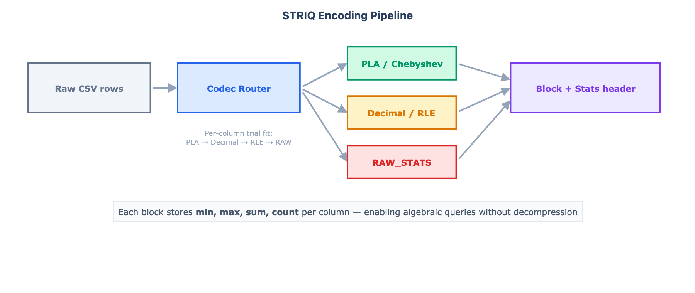

The **Codec Router** analyzes each column independently and picks the codec with the best bytes-per-point ratio. Candidates are tried in order: PLA → Decimal → RLE → RAW_STATS. Every compressed block embeds a stats header (`min`, `max`, `sum`, `count`) so queries never need to touch the raw data.

### PLA (Piecewise Linear Approximation)

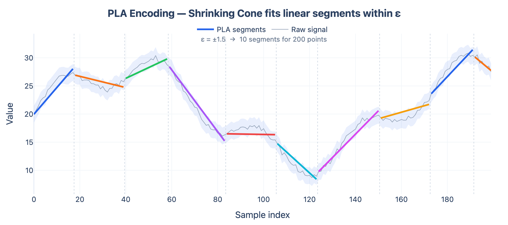

The **Shrinking Cone** algorithm walks the signal maintaining a valid slope interval `[s_lo, s_hi]`. Each new point tightens the interval. When the interval becomes empty, a segment is emitted and a new one starts. Every reconstructed value is guaranteed within `±ε` of the original. On smooth signals, **Chebyshev-3 polynomials** can extend segments 5–20x longer than linear fits by using cubic approximation within the same error bound.

### Algebraic Queries: O(blocks) instead of O(N)

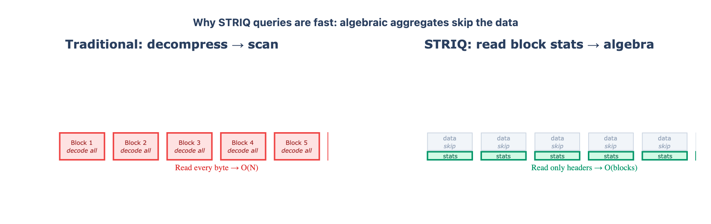

Traditional systems decompress every row to compute an aggregate. STRIQ reads only the per-block stats footer and computes `mean`, `min`, `max`, `variance`, and `count` using closed-form algebra over PLA segments (e.g., `sum = offset·L + slope·L(L-1)/2`). Kahan summation merges block results; Chan's formula merges variance. Time-range queries use a Delta-of-Delta index to skip irrelevant blocks entirely.

### Epsilon in Action

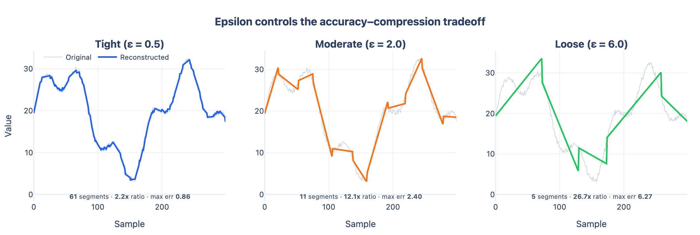

The user controls the tradeoff with a single parameter `ε`. A tight epsilon preserves nearly every detail; a loose one yields extreme compression by allowing coarser segment fits. The maximum reconstruction error is always bounded by `±ε`, which is guaranteed by the Shrinking Cone algorithm. Typical sensor workloads use `ε = 0.01` to `ε = 0.1` for a good balance between fidelity and size.

---

## Capabilities

| Operation | Description | Complexity | Example |
|---|---|---|---|
| `mean`, `sum`, `min`, `max`, `count`, `variance` | Algebraic aggregates over any time range | O(blocks) | `striq query f.striq mean temp` |
| `mean WHERE col > threshold` | Conditional aggregate | O(segments) | `striq query f.striq mean temp --where ">25.0"` |
| `value_at` | Point lookup at timestamp | O(1) block | `striq query f.striq value_at temp 170000...` |
| `scan` | Extract rows for time range | O(rows) | `striq query f.striq scan temp,pressure --from ... --to ...` |
| `downsample` | N equidistant PLA-evaluated points | O(segments) | `striq query f.striq downsample temp 1000` |
| `inspect` | File metadata | O(1) | `striq inspect f.striq` |
| `verify` | CRC32C integrity check | O(file) | `striq verify f.striq` |

---

## Detailed Benchmarks

<details>
<summary>Click to expand full benchmark plots</summary>

### Compression Ratio

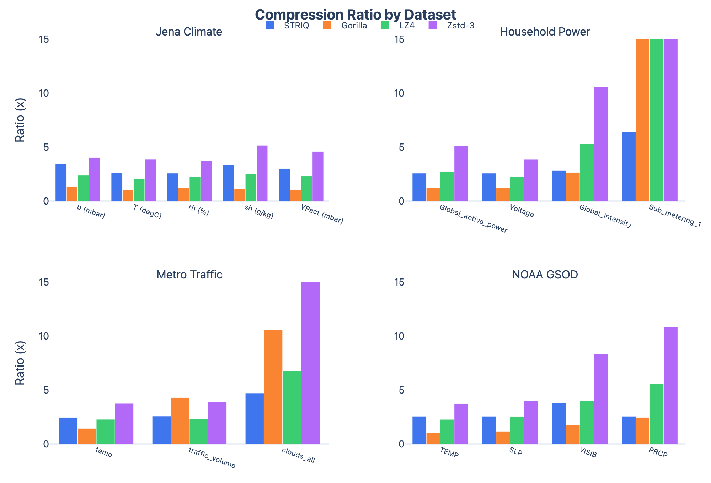

### Encode Throughput

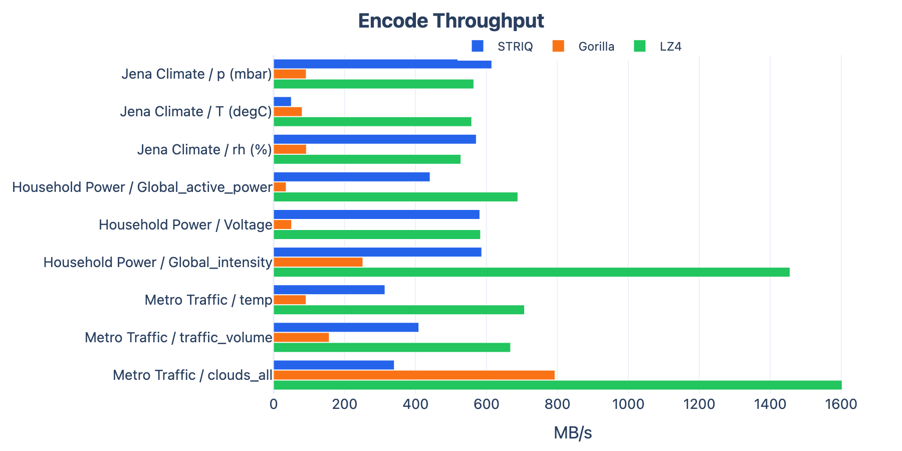

### Query Speed

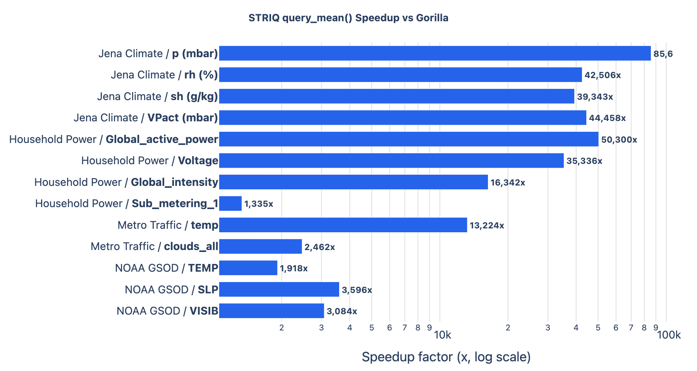

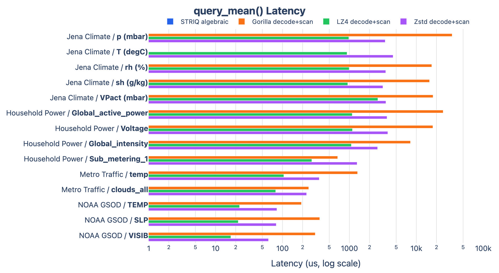

### All Query Operations

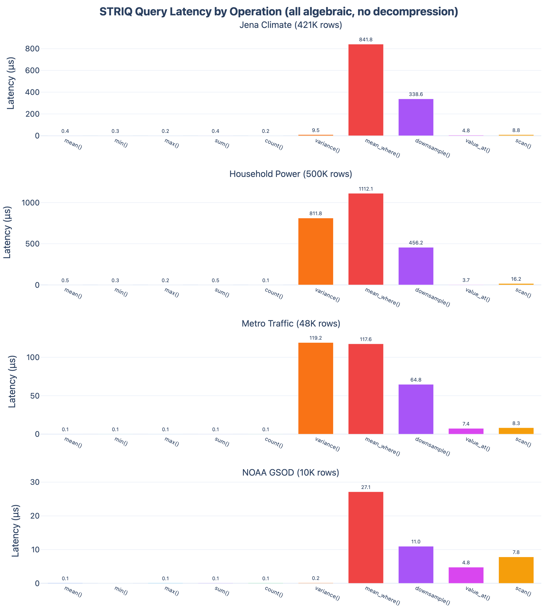

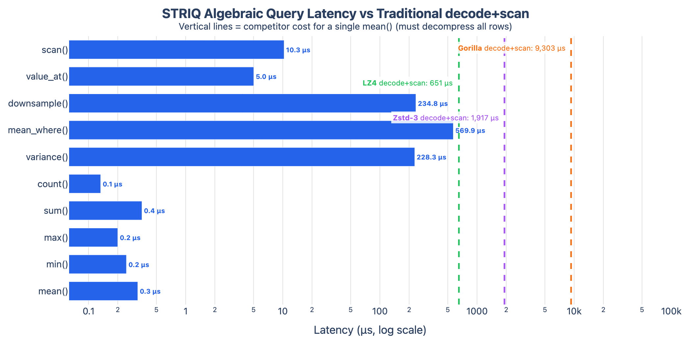

### Epsilon Tradeoff

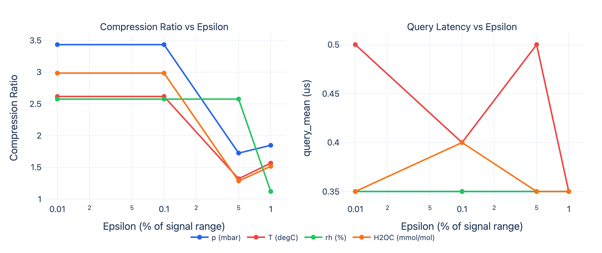

### Dataset Summary

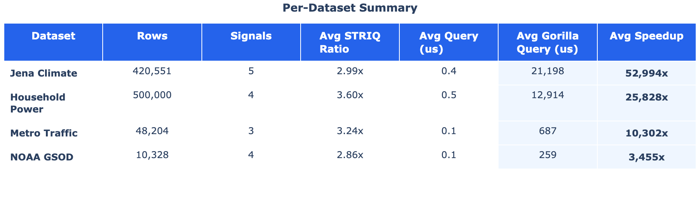

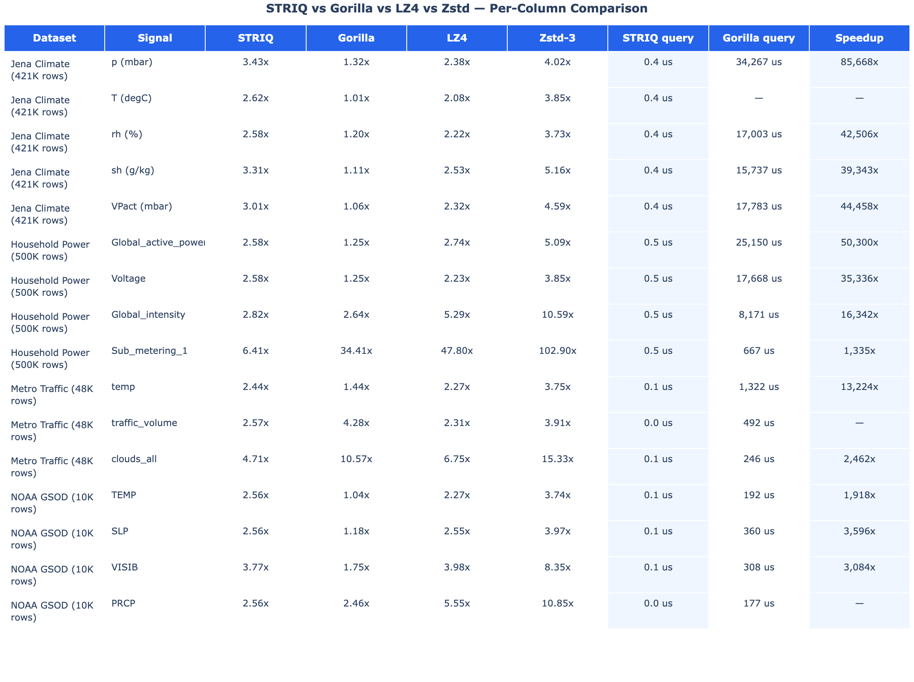

</details>

---

## Build

```bash
make            # library + CLI
make test       # unit tests (25 suites)
make bench      # benchmarks (needs system lz4 + zstd for comparison)
```

Benchmark dependencies (optional, only for `make bench`):

```bash
# macOS
brew install lz4 zstd

# Ubuntu
sudo apt install liblz4-dev libzstd-dev
```

STRIQ itself has no external dependencies.

---

## Reproduce Benchmarks

```bash
bash bench/reproduce.sh
```

---

## References & Related Work

STRIQ builds on techniques from time-series compression and numerical approximation:

| Technique | Used in STRIQ | Reference |
|---|---|---|
| **Piecewise Linear Approximation** | Core codec, Shrinking Cone segment fitting | Keogh et al., [*An Online Algorithm for Segmenting Time Series*](https://cs.ucr.edu/~eamonn/icdm-01.pdf) (ICDM 2001) |
| **Swing / Slide Filters** | Basis for the slope-interval fitting | Elmeleegy et al., [*Online Piece-wise Linear Approximation of Numerical Streams with Precision Guarantees*](https://infoscience.epfl.ch/server/api/core/bitstreams/ff911e08-e181-4b8a-a365-482628a3288e/content) (PVLDB 2009) |
| **Chebyshev Polynomials** | Extends PLA segments 5–20x on smooth data | Rivlin, *An Introduction to the Approximation of Functions* (Dover, 1969) |
| **Delta-of-Delta encoding** | Timestamp compression and range indexing | Pelkonen et al., [*Gorilla: A Fast, Scalable, In-Memory Time Series Database*](https://www.vldb.org/pvldb/vol8/p1816-teller.pdf) (PVLDB 2015) |
| **Kahan Summation** | Numerically stable aggregate merging | Kahan, [*Further Remarks on Reducing Truncation Errors*](https://dl.acm.org/doi/10.1145/363707.363723) (CACM 1965) |
| **Chan's Parallel Variance** | Merging variance across blocks | Chan, Golub & LeVeque, [*Updating Formulae and a Pairwise Algorithm for Computing Sample Variances*](https://link.springer.com/chapter/10.1007/978-3-642-51461-6_3) (COMPSTAT 1982) |

### Compared Against

| System | Type | Key difference |
|---|---|---|
| [Gorilla](https://www.vldb.org/pvldb/vol8/p1816-teller.pdf) (Facebook) | Lossless XOR-based | No approximation, larger files, no algebraic queries |
| [LZ4](https://github.com/lz4/lz4) / [Zstd](https://github.com/facebook/zstd) | General-purpose lossless | Domain-agnostic, no time-series structure, no queryability |
| [ALP](https://github.com/cwida/ALP) (CWI) | Lossless floating-point | Focused on doubles representation, different design goals (SIGMOD 2024) |
| [SimPiece](https://xkitsios.github.io/assets/pdf/simpiece-pvldb23.pdf) | Lossy PLA-based | Similar PLA approach; STRIQ adds algebraic queries and adaptive routing (PVLDB 2023) |

---

## License

Apache 2.0. See [LICENSE](LICENSE).
